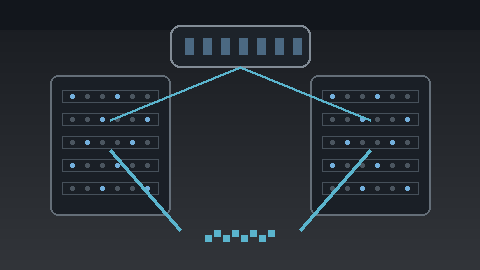

# Disaggregated LLM Serving Engine

<p align="center">
  
</p>

A C++/CUDA LLM serving project covering continuous batching, chunked prefill,
paged KV-cache management, CUDA Graph decode replay, and disaggregated
context/generation serving with TensorRT-LLM.

The repository contains two parts:

1. The original source snapshot assembled from the three upstream repositories
   specified for this project.
2. A clean implementation in `dlse_runtime/` that contains the serving runtime,
   benchmarks, tests, TensorRT-LLM integration and deployment scripts.

The three upstream repositories are:

| Component | Repository |
|---|---|
| LLaMA C inference reference | [karpathy/llama2.c](https://github.com/karpathy/llama2.c) |
| PyTorch LLaMA reference | [hkproj/pytorch-llama](https://github.com/hkproj/pytorch-llama) |
| CUDA HGEMM / WMMA / MMA reference | [Bruce-Lee-LY/cuda_hgemm](https://github.com/Bruce-Lee-LY/cuda_hgemm) |

Exact inspected revisions are recorded in
[`dlse_runtime/third_party/SOURCES.md`](dlse_runtime/third_party/SOURCES.md).

---

## 1. What the project implements

### Continuous batching and chunked prefill

The C++ scheduler keeps waiting prefill work and active decode work in separate
queues.

For every iteration it:

1. services active decode requests;
2. gives the remaining token budget to prompt prefill;
3. limits prompt work to a configured chunk size;
4. rotates incomplete prefills back into the waiting queue;
5. moves a request into decode as soon as its prompt is complete.

The main implementation is:

- `dlse_runtime/include/dlse/runtime.h`
- `dlse_runtime/src/runtime.cpp`
- `dlse_runtime/benchmarks/runtime_bench.cpp`

### Paged KV cache

`PagedKVCache` stores logical sequence length separately from physical page
locations. A request receives a new physical page only when its token count
crosses a page boundary.

The allocator reports:

- logical tokens;
- reserved token capacity;
- used/free pages;
- reserved KV bytes;
- internal fragmentation.

The CUDA path accepts the page table directly and compares it with a
contiguous-KV reference implementation.

### CUDA Graph decode path

`dlse_runtime/benchmarks/cuda_graph_bench.cu` contains a stateful one-dimensional
decode step.

The step counter and state remain on the GPU so the replay represents a real
autoregressive dependency. The benchmark compares ordinary host kernel
submissions with CUDA Graph replay.

### Disaggregated serving

TensorRT-LLM is used for the production-oriented context/generation serving
path.

The intended topology is:

```
Client
  |
  v
Disaggregated router :8000
  |                     |
  v                     v
Context / Prefill   Generation / Decode
GPU 0 :8001         GPU 1 :8002
  |                     ^
  +---- KV transfer ----+
```

The worker configuration uses the NIXL cache-transfer backend.

---

## 2. Repository layout

| Path | Purpose |
|---|---|
| `dlse_runtime/include/dlse/runtime.h` | Scheduler and paged KV-cache interfaces |
| `dlse_runtime/src/runtime.cpp` | Scheduler and page allocator implementation |
| `dlse_runtime/cuda/paged_attention.cu` | Contiguous and paged CUDA attention kernels |
| `dlse_runtime/benchmarks/runtime_bench.cpp` | Host scheduler/KV benchmark |
| `dlse_runtime/benchmarks/paged_attention_bench.cu` | CUDA correctness and A/B timing benchmark |
| `dlse_runtime/benchmarks/cuda_graph_bench.cu` | CUDA Graph launch benchmark |
| `dlse_runtime/benchmarks/trtllm_benchmark.py` | Concurrent TensorRT-LLM throughput/ITL benchmark |
| `dlse_runtime/python/dlse_trtllm.py` | TensorRT-LLM Python adapter |
| `dlse_runtime/configs/` | Aggregated and disaggregated serving configs |
| `dlse_runtime/scripts/` | Build, serve, benchmark and smoke-test commands |
| `dlse_runtime/tests/` | C++ unit tests |
| `docs/assets/` | Repository figures and validation evidence |
| `dlse_runtime/docs/` | Design and benchmark documentation |

---

## 3. Requirements

### Host-only validation

The host control plane does not need an NVIDIA GPU.

Required:

| Software | Version |
|---|---|
| C++ compiler | C++20 capable |
| CMake | 3.20 or newer |
| Bash | Required for the helper scripts |

Linux is the documented environment for the command-line workflow.

### Native CUDA validation

Required in addition to the host requirements:

- NVIDIA GPU;
- NVIDIA driver;
- CUDA toolkit with `nvcc`;
- CUDA architecture matching the target GPU.

The Makefile examples use CUDA architecture 86 because that is appropriate for
Ampere GPUs such as RTX 3090 and RTX A6000. A100 uses architecture 80. Change
the value when using another GPU.

### TensorRT-LLM

There are two supported ways to run the TensorRT-LLM path:

1. install TensorRT-LLM in an existing compatible CUDA environment;
2. use the provided NVIDIA container scripts.

The container route is recommended for a clean, reproducible environment.

---

## 4. Fresh clone: host build

Clone the repository and enter it:

```bash
git clone https://github.com/SpryzenHell/llm_serving.git
cd llm_serving
git checkout feat/dlse-runtime-revamp
```

Build and run the tests:

```bash
cmake -S . -B build -DCMAKE_BUILD_TYPE=Release
cmake --build build --parallel
ctest --test-dir build --output-on-failure
```

Run the host benchmark:

```bash
./build/bin/dlse_runtime_bench
```

The same workflow is available through:

```bash
make test
make dlse-bench
```

The project places executables under `build/bin/` so paths do not depend on
the CMake subdirectory layout.

---

## 5. Host validation result

The following result was obtained from the committed runtime sources in the
validation environment:

| Check | Result |
|---|---:|
| C++ compiler | GCC 14.2.0 |
| C++ test suite | 1 / 1 passed |
| Maximum decode gap | 1 scheduler iteration |
| Long prompt scheduled | 4096 tokens |
| Logical KV tokens | 3392 |
| Reserved KV tokens | 3392 |
| Contiguous KV reservation | 128.00 MiB |
| Paged KV reservation | 13.25 MiB |
| KV reservation reduction | 89.6484% |

The KV number is a controlled allocation comparison for the benchmark
workload. It is not a claim that 89.6484% of total process VRAM disappears.


Raw output is also stored in
[`docs/assets/host_validation.txt`](docs/assets/host_validation.txt).

---

## 6. Scheduler behavior

The benchmark starts eight continuously decoding requests, then admits a
4096-token prompt.

With the current configuration:

- decode receives 8 tokens per scheduler iteration;
- prefill receives 32 tokens per iteration while the long prompt is active;
- the measured decode gap is 1 iteration.


This benchmark validates the scheduler policy. It does not replace an
end-to-end ITL measurement on a real model and GPU.

---

## 7. KV-cache allocation

The host benchmark uses:

- page size: 16 tokens;
- maximum sequence length: 4096;
- batch size: 8;
- example KV footprint: 4096 bytes per logical token;
- sequence lengths: 128, 256, 512, 768, 1024, 128, 64, 512.

For this workload the contiguous baseline reserves the full
`8 x 4096` token capacity. The paged allocator reserves only the pages needed
for the actual sequence lengths.


The CUDA A/B benchmark additionally checks that paged and contiguous attention
produce matching outputs within the FP16 error tolerance.

---

## 8. CUDA build and benchmarks

On a CUDA-enabled machine:

```bash
cmake -S . -B build-cuda \
  -DDLSE_ENABLE_CUDA=ON \
  -DCMAKE_CUDA_ARCHITECTURES=86

cmake --build build-cuda --parallel

./build-cuda/bin/dlse_paged_attention_bench
./build-cuda/bin/dlse_cuda_graph_bench 10000
```

Or:

```bash
make dlse-cuda
```

The paged-attention benchmark reports:

- contiguous CUDA-event time;
- paged CUDA-event time;
- maximum absolute numerical error.

The CUDA Graph benchmark reports:

- baseline host submission time per step;
- graph replay host submission time per step;
- host enqueue reduction.

No GPU timing value is included in this README until the benchmark is run on
the target NVIDIA machine.

---

## 9. TensorRT-LLM container workflow

For a clean GPU environment, use the provided container helper:

```bash
./dlse_runtime/scripts/enter_trtllm_dev_container.sh
```

The helper uses:

```
nvcr.io/nvidia/tensorrt-llm/devel:1.3.0rc29
```

It mounts the repository at `/workspace/llm_serving` and mounts the user's
Hugging Face/cache directory.

Inside the container:

```bash
cmake -S . -B build-cuda \
  -DDLSE_ENABLE_CUDA=ON \
  -DCMAKE_CUDA_ARCHITECTURES=86

cmake --build build-cuda --parallel

./build-cuda/bin/dlse_paged_attention_bench
./build-cuda/bin/dlse_cuda_graph_bench 10000
```

For server execution, the runtime-container helper is available:

```bash
./dlse_runtime/scripts/enter_trtllm_runtime_container.sh
```

This uses:

```
nvcr.io/nvidia/tensorrt-llm/release:1.3.0rc29
```

NVIDIA documents these container-based TensorRT-LLM workflows in the official
TensorRT-LLM documentation.

---

## 10. Run an aggregated TensorRT-LLM server

Inside a compatible TensorRT-LLM environment:

```bash
./dlse_runtime/scripts/run_trtllm_server.sh \
  TinyLlama/TinyLlama-1.1B-Chat-v1.0
```

The server listens on:

```
http://127.0.0.1:8000
```

Check readiness:

```bash
curl -s -o /dev/null -w "Status: %{http_code}\n" \
  http://127.0.0.1:8000/health
```

Run the repository smoke test:

```bash
./dlse_runtime/scripts/smoke_test.sh \
  TinyLlama/TinyLlama-1.1B-Chat-v1.0
```

The smoke test checks `/health` and sends one OpenAI-compatible
`/v1/chat/completions` request.

TensorRT-LLM documents the same health and OpenAI-compatible endpoints.

---

## 11. Disaggregated TensorRT-LLM server

The repository provides separate context and generation configurations.

### Context / prefill worker

Uses GPU 0 by default:

```bash
./dlse_runtime/scripts/run_context_server.sh \
  TinyLlama/TinyLlama-1.1B-Chat-v1.0
```

### Generation / decode worker

Uses GPU 1 by default:

```bash
./dlse_runtime/scripts/run_generation_server.sh \
  TinyLlama/TinyLlama-1.1B-Chat-v1.0
```

### Router

Start the disaggregated router:

```bash
./dlse_runtime/scripts/run_disaggregated_server.sh
```

The router listens on port 8000 and forwards requests to the context worker on
8001 and generation worker on 8002.

For a two-GPU local setup, all three processes can be started together:

```bash
./dlse_runtime/scripts/run_local_disaggregated.sh \
  TinyLlama/TinyLlama-1.1B-Chat-v1.0
```

Worker logs are written under:

```
logs/disaggregated/
```

The context worker has `disable_overlap_scheduler: true`, and both workers use
the same NIXL cache-transfer backend.


---

## 12. TensorRT-LLM benchmark

The Python benchmark measures concurrent streaming requests.

Example:

```bash
PYTHONPATH=dlse_runtime/python \
python3 dlse_runtime/benchmarks/trtllm_benchmark.py \
  --model TinyLlama/TinyLlama-1.1B-Chat-v1.0 \
  --requests 8 \
  --max-tokens 64
```

The result contains:

- aggregate generated tokens/s;
- TTFT p50;
- ITL p50;
- ITL p99;
- per-request measurements.

Run the full request-count matrix:

```bash
./dlse_runtime/scripts/run_trtllm_matrix.sh \
  TinyLlama/TinyLlama-1.1B-Chat-v1.0
```

This runs request counts 1, 2, 4 and 8 and stores JSON results under
`dlse_runtime/results/`.

---

## 13. Runtime metrics

The TensorRT-LLM server exposes:

```
/health
/metrics
/version
```

After at least one inference request, collect the metrics:

```bash
./dlse_runtime/scripts/collect_server_metrics.sh
```

The returned metrics contain iteration latency, GPU memory usage and KV-cache
statistics. These are the measurements to use when evaluating the memory and
latency claims.

---

## 14. Benchmark methodology

The repository separates implementation from benchmark claims.

### Throughput

Run the same model, tokenizer, prompt distribution, generation length, GPU,
quantization and parallelism for the baseline and optimized configurations.

Compute:

```
optimized tokens/s
------------------
baseline tokens/s
```

The resume value of 8x should only be used when the measured ratio reaches 8
under the documented workload.

### KV memory

The repository defines the host allocator comparison as:

```
contiguous reservation - paged reservation
------------------------------------------
      contiguous reservation
```

The resulting percentage is a KV reservation reduction. A whole-process VRAM
claim requires the same model weights and other GPU allocations in both runs.

### CUDA Graph launch

The included graph benchmark reports host enqueue overhead. It is not the same
quantity as kernel execution time or end-to-end ITL.

For the final <2 microsecond resume statement, record the exact measurement
method, GPU, CUDA version, driver version and warm-up policy.

---

## 15. Resume evidence

| Resume statement | Repository implementation | Required measurement |
|---|---|---|
| Bounded ITL with continuous batching and chunked prefill | C++ scheduler + benchmark | End-to-end target-GPU ITL under mixed request lengths |
| 8x inference throughput | TensorRT-LLM benchmark matrix | Same-workload baseline/optimized ratio of at least 8 |
| >60% wasted VRAM recovered | Paged KV allocator + CUDA A/B benchmark | Controlled KV/process memory comparison supporting the percentage |
| <2 microsecond launch latency | CUDA Graph benchmark | Target-GPU timing that supports the exact wording |

The current repository contains the implementation and the measurement
harnesses. The GPU-dependent numeric claims remain inputs to be measured on the
target hardware.

---

## 16. Development commands

```bash
make test
make dlse-bench
make dlse-cuda
make clean
```

Useful direct commands:

```bash
cmake -S . -B build
cmake --build build --parallel
ctest --test-dir build --output-on-failure
```

Record the execution environment before a benchmark:

```bash
./dlse_runtime/scripts/record_environment.sh
```

---

## 17. Figures and validation assets

The README figures are kept in `docs/assets/` and are generated from the
repository implementation or from an executed host benchmark.


No GPU throughput, GPU memory or kernel-latency screenshot is presented as a
measured result until it has been produced by the CUDA/TensorRT-LLM benchmark
on the target machine.

---

## 18. TensorRT-LLM documentation

The TensorRT-LLM integration in this repository follows the current
`trtllm-serve` and LLM API documentation:

- [trtllm-serve](https://nvidia.github.io/TensorRT-LLM/commands/trtllm-serve.html)
- [Disaggregated Serving](https://nvidia.github.io/TensorRT-LLM/features/disagg-serving.html)
- [LLM API Reference](https://nvidia.github.io/TensorRT-LLM/llm-api/reference.html)

The documentation is external to this repository; the pinned container tag in
the helper scripts provides a reproducible execution environment.

---

## 19. Source provenance

The inspected upstream revisions are listed in
[`dlse_runtime/third_party/SOURCES.md`](dlse_runtime/third_party/SOURCES.md).

The original merged tree is retained for reference. The executable serving
implementation is isolated under `dlse_runtime/` so it can be built, tested
and benchmarked independently.

